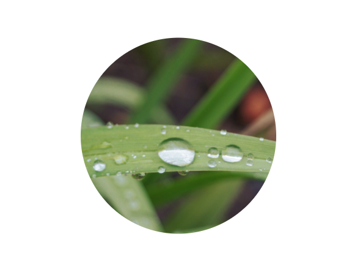
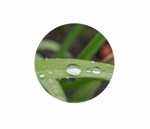
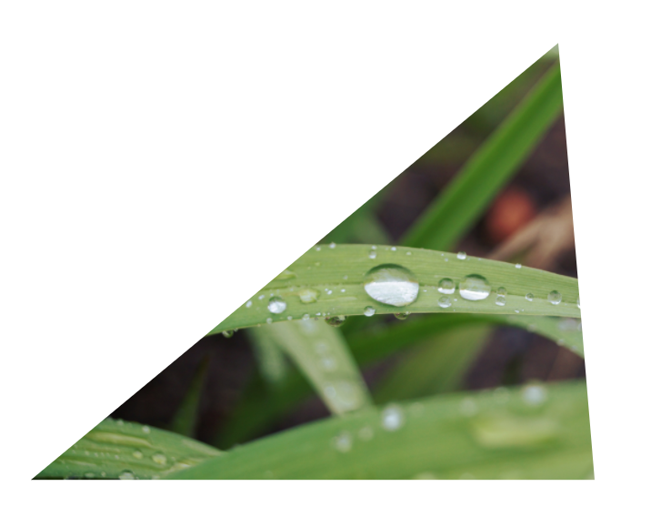
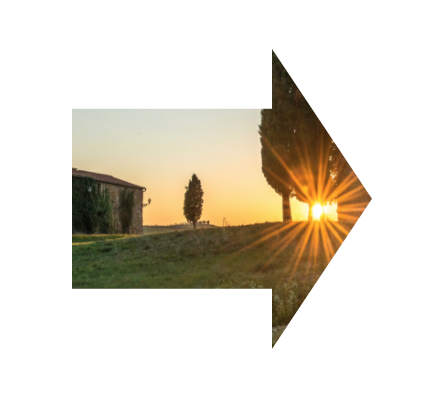
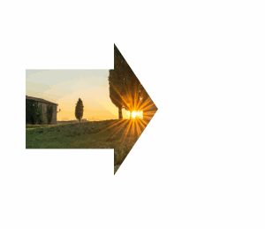
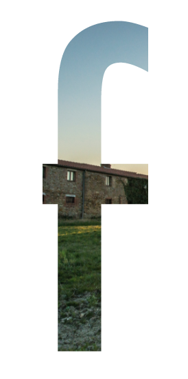
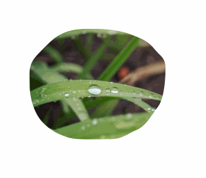

# Clip Path

`clip-path` を 使って :scissors: 切り抜きをしてみましょう。

## :page_facing_up:

HTML を確認・修正するには、`public/index.html`、  
CSS は、`public/assets/css/clippath.css` です。

## Circle

### まずはトライ！

簡単なところから、円形で切り抜いてみます。:black_circle:

切り抜きたい要素に対して、  
`clip-path: circle(半径 at x座標　y座標);`  
で、切り抜く円のサイズと場所を指定します。

CSS ファイルの、`.ClipCircle` に追記してください。:pencil2:

```css
.ClipCircle {
  clip-path: circle(80px at 200px 130px);
}
```

書けたら、HTML をブラウザで確認してみてください。  
下のキャプチャのようになりましたか？



これは、`x: 200px, y: 130px` の位置で、半径 `80px` の円で切り抜いています。

### Hover で大きく

では次に、`hover` 状態のときに、半径が大きくなるように指定してみましょう。  
:pencil2::pencil2:

```css
.ClipCircle:hover {
  clip-path: circle(120px at 200px 130px);
  cursor: pointer;
}
```

下のキャプチャのようになったら成功です！



せっかくなので、ついでに、アニメーション化してみます。
clip-path を、0.5秒でかけて変化させてあげましょう。:pencil2::pencil2::pencil2:

```css
.ClipCircle {
  clip-path: circle(80px at 200px 130px);
  transition: clip-path .5s ease-in;
}
```

下のキャプチャのようになったら成功です！


## Triangle

では、三角形に切り抜きたい場合はどうすれば良いでしょうか？  
Circle のときと、ほぼ同じように出来るのですが、  
`triangle()` はありませんので、`polygon()` を使います！

新しく、`.CircleTriangle {}` を作りましょう。

```css
.ClipTriangle {
  polygon(290px 10px, 0 250px, 310px 250px);
}
```

これは、点を3つ取り繋げる指定となります。

`polygon(1点目の座標, 2点目の座標, 3点目の座標);`

書けたら、HTML をブラウザで確認してみてください。  
下のキャプチャのようになりましたか？



## Arrow

Triangle で切り抜くには、`polygon` を使って、3点の座標を指定する必要がありました。  
しかし、`polygon` はもっとたくさんの座標を指定することが出来ます。  
今度は、より複雑な図形に挑戦してみたいと思います。

矢印です！:arrow_right::arrow_right::arrow_right:

```css
.ClipArrowRight {
  clip-path: polygon(
    80px 90px,
    180px 90px,
    180px 60px,
    230px 135px,
    180px 210px,
    180px 180px,
    80px 180px
  );
}
```

下のキャプチャのようになれば成功です！



### Hover で矢印を伸ばす

では問題です！下のキャプチャのように、  
`hover` 状態のときに、矢印が右に伸びるよう指定してみてください。



## さらに複雑な図形で！

これまで、`circle()`, `polygon()` と試してきました。   
ですが、このように用意された関数は、他に `inset()` があるのみで、  
これらでは、なんでも好きなように切り取ることは出来ません。

そこで、`url();`を使い、**SVG** を利用します。

### clipPath

SVG には、`<clipPath>` という要素があります。  
`<clipPath>` の中に、切り抜きたい図形を定義してみましょう。

今回は既に円形や多角形は試してきましたので、  
変なかたちに切り抜いてみたいと思います。


↑ これの `path` は、以下です。

```xml
<path d="M56.7359047,142.956148 L56.7359047,249.65625 L25.1727855,249.65625 L25.1727855,142.956148 L14,142.956148 L14,113.627586 L25.1727855,113.627586 L25.1727855,61.1154939 C25.1727855,43.9838037 28.1521652,31.8800737 34.111014,24.8039409 C42.304431,14.9345976 54.2219498,10 69.8639277,10 C75.4503484,10 82.4798224,11.6293483 90.9525605,14.8880937 L90.9525605,47.0098521 L87.7403846,45.3339343 C80.9435728,41.8889749 75.3572358,40.166521 70.9812063,40.166521 C65.3947856,40.166521 61.6240082,42.1682917 59.6687609,46.1718932 C57.7135137,50.0823877 56.7359047,57.6239425 56.7359047,68.7967839 L56.7359047,113.627586 L90.9525605,113.627586 L90.9525605,142.956148 L56.7359047,142.956148 Z"></path>
```

これを使って、clipPath を定義します。  
今回は、index.html の中に書くことにします。

```xml
<svg>
  <defs>
    <clipPath id="text-f">
      <path d="M56.7359047,142.956148 L56.7359047,249.65625 L25.1727855,249.65625 L25.1727855,142.956148 L14,142.956148 L14,113.627586 L25.1727855,113.627586 L25.1727855,61.1154939 C25.1727855,43.9838037 28.1521652,31.8800737 34.111014,24.8039409 C42.304431,14.9345976 54.2219498,10 69.8639277,10 C75.4503484,10 82.4798224,11.6293483 90.9525605,14.8880937 L90.9525605,47.0098521 L87.7403846,45.3339343 C80.9435728,41.8889749 75.3572358,40.166521 70.9812063,40.166521 C65.3947856,40.166521 61.6240082,42.1682917 59.6687609,46.1718932 C57.7135137,50.0823877 56.7359047,57.6239425 56.7359047,68.7967839 L56.7359047,113.627586 L90.9525605,113.627586 L90.9525605,142.956148 L56.7359047,142.956148 Z"></path>
    </clipPath>
  </defs>
</svg>
```

`<path />` には `d` があればOKで、  
`<clipPath />` には、指定するための ID を定義します。

CSS側は単純で、外部ファイルではないので、↑で定義した ID だけを指定します。

```css
.ClipSVG {
  clip-path: url(#text-f);
}
```

成功すれば、このように指定した `<path />` に沿って切り抜かれます。




## 最後に

SVG を利用すればほぼどんなかたちにでも切り抜くことが出来ますね！

### おまけ

Animation もできる！




```xml
<defs>
  <clipPath id="animation-sample">
    <path d="M145.15732,204.361328 C163.175961,204.361328 168.310007,197.962162 183.022554,191.589844 C198.468889,184.899707 205.400282,169.637559 214.639742,157.923828 C224.248396,145.742035 225.995211,116.860573 225.995211,101.505859 C225.995211,85.6661918 219.321171,84.8580266 209.145601,72.4335938 C200.33555,61.6764669 192.754547,57.3696557 178.085054,51.453125 C162.436804,45.14184 140.91057,44 122.167086,44 C97.706466,44 84.6822874,44.5568071 67.0616168,55.7167969 C59.3933533,60.5734646 42.7628342,77.8895523 37.1612262,84.2578125 C25.8454859,97.1222575 28.2041949,108.552596 28.2041949,125.335938 C28.2041949,143.799592 34.3072647,167.176391 47.768648,180.714844 C58.6885537,191.697268 68.299787,196.894392 85.018648,202.248047 C97.0086527,206.087444 131.394945,204.361328 145.15732,204.361328 Z">
      <animate
        dur="2s"
        repeatCount="indefinite"
        attributeName="d"
        values="M149.15732,206.361328 C167.175961,206.361328 172.310007,199.962162 187.022554,193.589844 C202.468889,186.899707 209.400282,171.637559 218.639742,159.923828 C228.248396,147.742035 229.995211,118.860573 229.995211,103.505859 C229.995211,87.6661918 223.321171,86.8580266 213.145601,74.4335938 C204.33555,63.6764669 196.754547,59.3696557 182.085054,53.453125 C166.436804,47.14184 144.91057,46 126.167086,46 C101.706466,46 88.6822874,46.5568071 71.0616168,57.7167969 C63.3933533,62.5734646 46.7628342,79.8895523 41.1612262,86.2578125 C29.8454859,99.1222575 32.2041949,110.552596 32.2041949,127.335938 C32.2041949,145.799592 38.3072647,169.176391 51.768648,182.714844 C62.6885537,193.697268 72.299787,198.894392 89.018648,204.248047 C101.008653,208.087444 135.394945,206.361328 149.15732,206.361328 Z;
M149.15732,206.361328 C167.175961,206.361328 172.310007,199.962162 187.022554,193.589844 C202.468889,186.899707 209.400282,171.637559 218.639742,159.923828 C228.248396,147.742035 229.995211,118.860573 229.995211,103.505859 C229.995211,87.6661918 223.321171,86.8580266 213.145601,74.4335938 C204.33555,63.6764669 191.161681,65.1626245 176.492188,59.2460938 C160.843938,52.9348087 144.91057,46 126.167086,46 C101.706466,46 88.6822874,46.5568071 71.0616168,57.7167969 C63.3933533,62.5734646 46.7628342,79.8895523 41.1612262,86.2578125 C29.8454859,99.1222575 32.2041949,110.552596 32.2041949,127.335938 C32.2041949,145.799592 38.3072647,169.176391 51.768648,182.714844 C62.6885537,193.697268 72.299787,198.894392 89.018648,204.248047 C101.008653,208.087444 135.394945,206.361328 149.15732,206.361328 Z;
M149.15732,206.361328 C167.175961,206.361328 172.310007,199.962162 187.022554,193.589844 C202.468889,186.899707 209.400282,171.637559 218.639742,159.923828 C228.248396,147.742035 228.548828,123.35862 228.548828,108.003906 C228.548828,92.1642387 223.321171,86.8580266 213.145601,74.4335938 C204.33555,63.6764669 196.754547,59.3696557 182.085054,53.453125 C166.436804,47.14184 144.91057,46 126.167086,46 C101.706466,46 88.6822874,46.5568071 71.0616168,57.7167969 C63.3933533,62.5734646 46.7628342,79.8895523 41.1612262,86.2578125 C29.8454859,99.1222575 32.2041949,110.552596 32.2041949,127.335938 C32.2041949,145.799592 42.0620542,165.524047 55.5234375,179.0625 C66.4433431,190.044925 72.299787,198.894392 89.018648,204.248047 C101.008653,208.087444 135.394945,206.361328 149.15732,206.361328 Z;
M149.15732,206.361328 C167.175961,206.361328 172.310007,199.962162 187.022554,193.589844 C202.468889,186.899707 209.400282,171.637559 218.639742,159.923828 C228.248396,147.742035 229.995211,118.860573 229.995211,103.505859 C229.995211,87.6661918 223.321171,86.8580266 213.145601,74.4335938 C204.33555,63.6764669 196.754547,59.3696557 182.085054,53.453125 C166.436804,47.14184 144.91057,46 126.167086,46 C101.706466,46 88.6822874,46.5568071 71.0616168,57.7167969 C63.3933533,62.5734646 46.7628342,79.8895523 41.1612262,86.2578125 C29.8454859,99.1222575 32.2041949,110.552596 32.2041949,127.335938 C32.2041949,145.799592 38.3072647,169.176391 51.768648,182.714844 C62.6885537,193.697268 75.2987171,195.882673 92.0175781,201.236328 C104.007583,205.075725 135.394945,206.361328 149.15732,206.361328 Z">
      </animate>
    </path>
  </clipPath>
</defs>
```

```html
<svg width="256" height="256" >
  <image clip-path="url(#animation-sample)" height="256" width="256" xlink:href="assets/images/02.jpg" />
</svg>
```
